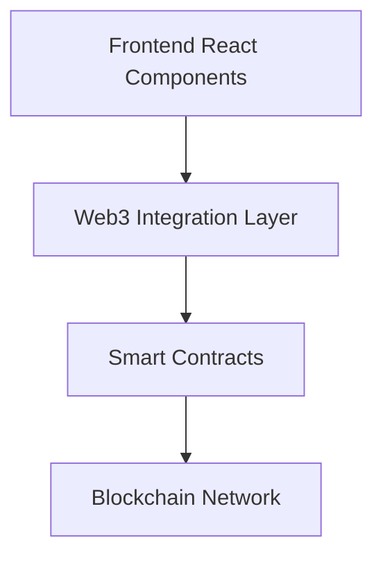

# Architecture

## Components

- **Frontend**: React + Tailwind UI for user interface.
- **Web3 Layer**: Interacts with smart contracts via ethers.js or web3.js.
- **Smart Contracts**: Deployed on REChain Network.
- **Backend Services (optional)**: API services for indexing or notifications.
